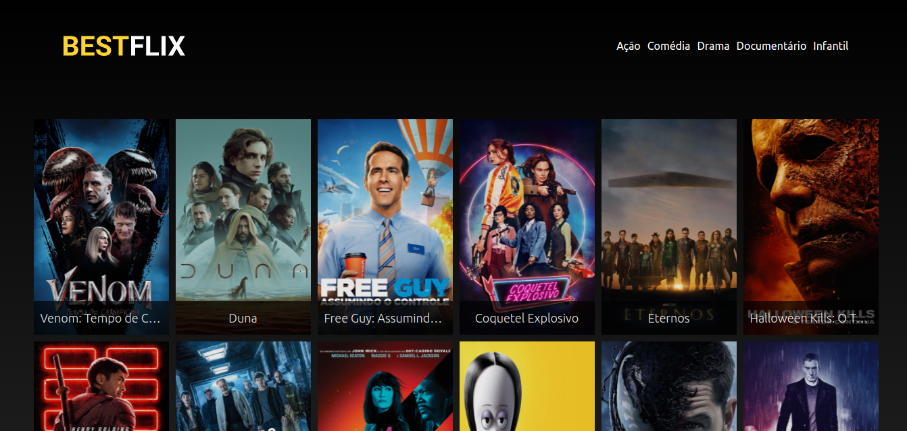
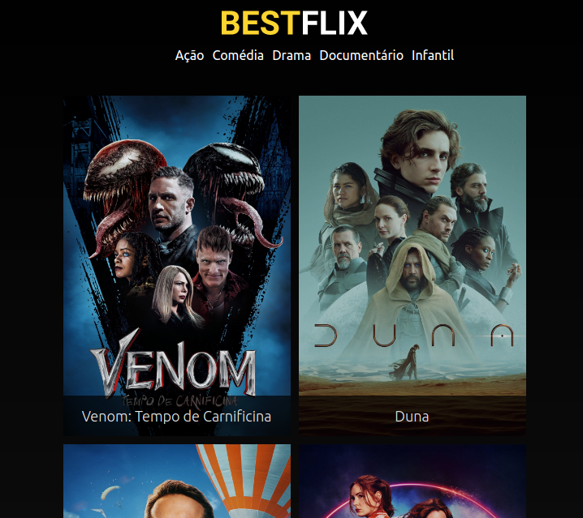
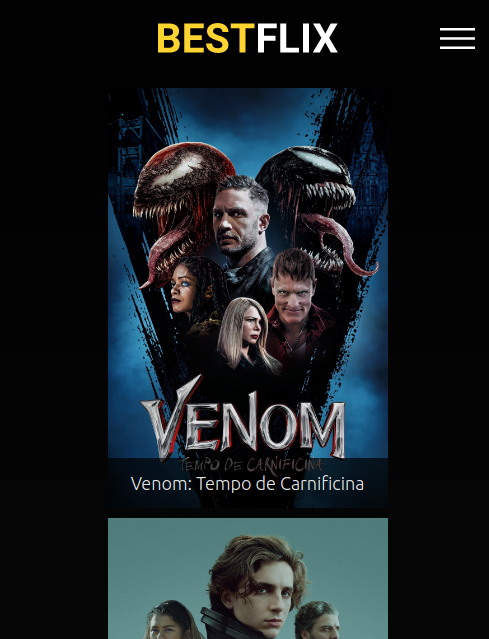

# Bestflix

The purpose of this React project was the development of a movie streaming service using Responsive Web Design and API Consumption concepts.

* Fullscreen:



* Smaller screens:



* Mobile:



Did you like the project? Just download the repository, open a new terminal within the project and enter the command:

```
npm start
```